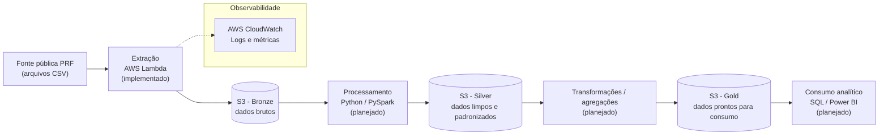

# DataRoad Analytics

Projeto pessoal de Engenharia de Dados construído para demonstrar, na prática, competências técnicas relevantes para uma vaga de **Engenheiro(a) de Dados Júnior**: ingestão, armazenamento, processamento distribuído, transformação e disponibilização de dados públicos utilizando serviços AWS e uma arquitetura Data Lake em camadas (Medallion).

> **Status do projeto:** em desenvolvimento inicial. Apenas a etapa de extração/ingestão (Lambda) possui código-fonte. As demais etapas descritas neste README (Silver, Gold, PySpark, Data Quality, particionamento etc.) estão documentadas como **planejadas**, servindo como guia de evolução do projeto.

## Sobre o projeto

O **DataRoad Analytics** utiliza como fonte de dados os arquivos públicos de acidentes de trânsito disponibilizados pela **Polícia Rodoviária Federal (PRF)**. O objetivo é construir, de ponta a ponta, um pipeline de dados que baixe os arquivos públicos, armazene-os em um Data Lake na AWS S3, processe-os com Python/PySpark e os disponibilize em camadas cada vez mais refinadas (Bronze, Silver, Gold) para consumo analítico.

O projeto é usado como estudo de caso e portfólio técnico, priorizando práticas reais de mercado: Infraestrutura como Código, princípio do menor privilégio em IAM, versionamento com Git, logging/monitoramento e separação clara entre dados brutos e dados tratados.

## Objetivos

**Técnicos:**
- Praticar ingestão de dados públicos e armazenamento em Data Lake (S3)
- Aplicar a arquitetura Medallion (Bronze / Silver / Gold)
- Praticar Infraestrutura como Código com AWS SAM/CloudFormation
- Aplicar o princípio do menor privilégio em políticas IAM
- Utilizar Python (Pandas/PyArrow) e, para maiores volumes, Apache Spark/PySpark
- Padronizar formatos de dados (CSV → Parquet) e particionamento
- Implementar logging e monitoramento via AWS CloudWatch
- Versionar o projeto seguindo boas práticas de Git/GitHub

**De negócio/domínio:**
- Disponibilizar dados de acidentes de trânsito da PRF de forma estruturada e consultável
- Servir de base para futuras análises exploratórias e dashboards (ex.: Power BI)

## Arquitetura

A arquitetura é dividida entre extração (implementada como Lambda), armazenamento em camadas no S3 (Medallion) e processamento (planejado com Python/PySpark).



Hoje, o único componente com código funcional é a Lambda de extração, que lê um objeto de um bucket S3 usando um cliente S3 (`boto3`) e um parser de CSV/XLSX (`pandas`/`openpyxl`). O restante do fluxo (Silver, Gold, PySpark) ainda não possui implementação no repositório.

## Tecnologias

**Linguagem**
- Python 3.13 (runtime definido no `template.yml` da Lambda)

**Engenharia de Dados**
- Pandas (leitura/parsing de CSV e XLSX)
- PyArrow e Apache Parquet (planejado)
- Apache Spark / PySpark (planejado, para processamento distribuído das camadas Silver/Gold)

**AWS**
- AWS S3 (Data Lake)
- AWS Lambda (extração/ingestão)
- AWS IAM (controle de acesso e permissões)
- AWS CloudWatch (logs, via execução da Lambda)
- AWS SAM / CloudFormation (Infraestrutura como Código)

**Processamento**
- Boto3 (SDK AWS para Python)
- Pandas / NumPy

**Armazenamento**
- Amazon S3 (formato CSV atualmente; Parquet planejado para Silver/Gold)

**DevOps**
- Git / GitHub (versionamento)
- AWS SAM CLI (build e deploy)
- Docker (planejado, para build/execução local de Lambdas quando necessário)
- Poetry (planejado, para gerenciamento de dependências e ambiente virtual)

**Qualidade**
- Data Quality (planejado: validação de schema, nulos, duplicidades, tipos)

**Visualização**
- Power BI (planejado, consumo futuro dos dados da camada Gold)

## Fonte dos dados

Os dados utilizados são os arquivos públicos de **Boletins de Acidentes de Trânsito (BAT)** disponibilizados pela Polícia Rodoviária Federal, em formato CSV, no Portal de Dados Abertos da PRF:

🔗 [Dados Abertos da PRF](https://www.gov.br/prf/pt-br/acesso-a-informacao/dados-abertos/dados-abertos-da-prf)

Os arquivos são publicados anualmente (agrupados por ocorrência e por pessoa), atualizados mensalmente pela DIOP/PRF, e distribuídos compactados em formato CSV. No estado atual do projeto, o download/ingestão automatizada desses arquivos ainda **não está implementado**: a Lambda de extração já sabe ler um objeto CSV/XLSX de um bucket S3, mas o download a partir do portal da PRF e o upload inicial para o S3 fazem parte do roadmap (ver seção [Roadmap](#roadmap)).

## Arquitetura Medallion

### Bronze

Responsável por armazenar os dados **exatamente como recebidos da fonte**, sem qualquer transformação, preservando o formato original (CSV). Serve como camada de auditoria e reprocessamento — se um erro for identificado nas camadas seguintes, os dados brutos continuam disponíveis para reprocessamento.

*Status: parcialmente suportado — a Lambda de extração já é capaz de ler/gravar objetos no S3, mas a definição formal de um bucket/prefixo "Bronze" ainda não existe no `template.yml` (planejado).*

### Silver

Camada onde os dados passam por limpeza, padronização de tipos, tratamento de valores nulos/inconsistentes e normalização de schema, deixando-os prontos para uso analítico intermediário. Planejada para ser processada com Python/PySpark.

*Status: planejado — nenhum processamento de limpeza/padronização está implementado no repositório.*

### Gold

Camada com dados agregados e modelados para consumo direto por ferramentas analíticas (SQL, BI). Contém as agregações e métricas de negócio (ex.: acidentes por UF, por tipo, por período).

*Status: planejado.*

## Estrutura do projeto

Estrutura real do repositório no estado atual:

```
DataRoad-Analytics/
├── README.md
├── .gitignore
└── lambdas/
    └── extractor/
        ├── lambda_function.py          # handler da Lambda de extração
        ├── requirements.txt            # dependências da Lambda (atualmente vazio)
        ├── samconfig.toml              # configuração de deploy do AWS SAM
        ├── template.yml                # template SAM/CloudFormation (IAM Role + Lambda)
        └── packages/
            ├── dataroad_extractor_s3_client.py       # wrapper do cliente S3 (get/put/list object)
            ├── dataroad_extractor_s3_enviroment.py    # placeholder para leitura de variáveis de ambiente (não implementado)
            └── dataroad_extractor_s3_parser.py        # parser de arquivos CSV/XLSX com pandas/openpyxl
```

Não há, no momento, diretórios de `tests/`, jobs PySpark, scripts de camada Silver/Gold ou pipelines de orquestração — esses itens fazem parte do roadmap.

## Pré-requisitos

Para trabalhar com o projeto localmente, é necessário ter instalado/configurado:

- [Python 3.13](https://www.python.org/) (mesma versão do runtime da Lambda)
- [Git](https://git-scm.com/)
- [AWS CLI](https://docs.aws.amazon.com/cli/latest/userguide/getting-started-install.html) configurada com um profile válido
- [AWS SAM CLI](https://docs.aws.amazon.com/serverless-application-model/latest/developerguide/install-sam-cli.html)
- [Docker](https://www.docker.com/) (necessário apenas se for usar `sam local invoke`/`sam build --use-container`, pois o SAM CLI utiliza containers para emular o runtime Lambda)
- Uma conta AWS com permissões para criar/gerenciar recursos IAM, Lambda e S3
- (Planejado) [Poetry](https://python-poetry.org/) para gerenciamento de dependências — hoje o projeto ainda usa `requirements.txt`

## Configuração do ambiente

O repositório ainda não possui `pyproject.toml`/Poetry configurado — apenas um `requirements.txt` (atualmente vazio). Enquanto o `pyproject.toml` não é adicionado, o ambiente pode ser configurado manualmente com `venv`:

```powershell
# Criar e ativar o ambiente virtual
python -m venv .venv
.\.venv\Scripts\Activate.ps1

# Instalar as dependências utilizadas pelo código da Lambda
pip install boto3 pandas openpyxl
```

> As dependências acima foram identificadas a partir dos `import` presentes em [lambda_function.py](lambdas/extractor/lambda_function.py) e nos módulos de [packages/](lambdas/extractor/packages). O arquivo [requirements.txt](lambdas/extractor/requirements.txt) deve ser preenchido com essas dependências (ver seção [TODO](#todo)) e, futuramente, substituído/complementado por um `pyproject.toml` gerenciado via Poetry.

## Configuração AWS

O projeto não versiona nenhuma credencial. Antes de executar ou fazer deploy, configure um profile da AWS CLI dedicado ao projeto:

```powershell
aws configure --profile dataroad-analytics
```

Você será solicitado a informar `AWS Access Key ID`, `AWS Secret Access Key`, região padrão (o projeto usa `us-east-2`, conforme [samconfig.toml](lambdas/extractor/samconfig.toml)) e formato de saída. Esses valores ficam armazenados localmente em `~/.aws/credentials` e `~/.aws/config` — **arquivos que nunca devem ser commitados**.

Para usar o profile nos comandos do SAM CLI:

```powershell
sam build --profile dataroad-analytics
sam deploy --profile dataroad-analytics
```

Ou defina a variável de ambiente da sessão do terminal:

```powershell
$env:AWS_PROFILE = "dataroad-analytics"
```

**Recursos AWS necessários (conforme [template.yml](lambdas/extractor/template.yml)):**
- Um bucket S3 já existente chamado `dev-raw-analytics` (o template **não cria** o bucket — ele é referenciado como recurso externo pré-existente na política IAM). É necessário criá-lo manualmente antes do deploy, por exemplo:
  ```powershell
  aws s3 mb s3://dev-raw-analytics --region us-east-2 --profile dataroad-analytics
  ```
- Permissão do usuário/perfil para criar roles IAM e Lambdas (necessário para `sam deploy`, que usa `CAPABILITY_IAM`)

## Configuração das variáveis de ambiente

As variáveis abaixo são declaradas na seção `Environment.Variables` da função Lambda em [template.yml](lambdas/extractor/template.yml):

| Variável | Valor definido no template | Observação |
|---|---|---|
| `dev_mode` | `false` | Não é lida no código-fonte atual (`os.environ` não é utilizado) |
| `custom_app_type` | `transaction` | Não é lida no código-fonte atual |
| `custom_app_process_stage` | `extractor` | Não é lida no código-fonte atual |
| `bucket_name` | `dev-raw-analytics` | Não é lida no código-fonte atual — o handler usa `"my-bucket"` como valor fixo |

> **Inconsistência identificada:** o arquivo [dataroad_extractor_s3_enviroment.py](lambdas/extractor/packages/dataroad_extractor_s3_enviroment.py) existe como placeholder para futuramente ler essas variáveis via `os.environ`, mas hoje é uma classe vazia. O handler em [lambda_function.py](lambdas/extractor/lambda_function.py) usa valores hardcoded (`bucket_name="my-bucket"`, `object_key="data.csv"`) em vez das variáveis de ambiente do template. Isso está registrado como item a corrigir na seção [TODO](#todo).

Nenhuma credencial (Access Key, Secret Key, tokens) é definida como variável de ambiente do projeto — credenciais são resolvidas via IAM Role (em produção) ou via profile da AWS CLI (localmente).

## Execução local

A Lambda pode ser executada localmente de duas formas:

**1. Executando o handler diretamente com Python** (útil para depuração rápida, sem emular o ambiente Lambda):

```powershell
cd lambdas/extractor
python lambda_function.py
```

Isso executa o bloco `if __name__ == "__main__":` do [lambda_function.py](lambdas/extractor/lambda_function.py), que chama `lambda_handler` com um evento local (`{"source": "local"}`). É necessário ter credenciais AWS válidas configuradas (via profile) para que a chamada real a `boto3.client("s3")` funcione, e o bucket/objeto (`my-bucket`/`data.csv`) referenciado no código precisa existir.

Também é possível depurar usando a configuração já presente em [.vscode/launch.json](.vscode/launch.json) ("Python: Lambda Extractor"), que executa o mesmo módulo com o `PYTHONPATH` apontando para `lambdas/extractor`.

**2. Emulando o runtime Lambda com AWS SAM CLI** (requer Docker):

```powershell
cd lambdas/extractor
sam build
sam local invoke DataRoadAnalyticsFunction
```

**Execução de testes:** o repositório ainda não possui testes automatizados (não há diretório `tests/` nem dependências de teste declaradas). A criação de testes unitários/integração está listada no [TODO](#todo).

## Deploy AWS

O deploy é feito via AWS SAM, a partir do diretório da Lambda:

```powershell
cd lambdas/extractor
sam build
sam deploy --guided
```

O parâmetro `--guided` é recomendado na primeira execução para revisar interativamente as configurações de deploy. As execuções seguintes podem reutilizar a configuração salva em [samconfig.toml](lambdas/extractor/samconfig.toml):

```powershell
sam deploy
```

**Configuração de deploy atual** (definida em [samconfig.toml](lambdas/extractor/samconfig.toml)):
- Stack: `dataroad-analytics-extractor`
- Região: `us-east-2`
- `resolve_s3 = true` (o SAM gerencia automaticamente o bucket de deployment artifacts)
- `capabilities = "CAPABILITY_IAM"` (necessário pois o template cria uma role IAM)
- `confirm_changeset = true` (solicita confirmação antes de aplicar mudanças no CloudFormation)

**Recursos provisionados pela stack** (definidos em [template.yml](lambdas/extractor/template.yml)):
- `LambdaExecutionRole`: IAM Role com política restrita de acesso ao bucket `dev-raw-analytics`
- `DataRoadAnalyticsFunction`: função Lambda (`python3.13`, 512 MB, timeout de 900s)

## Monitoramento

A função Lambda usa a política gerenciada `AWSLambdaBasicExecutionRole`, que concede permissão para escrever logs no **AWS CloudWatch Logs** automaticamente.

Para visualizar os logs:

```powershell
sam logs --name DataRoadAnalyticsFunction --stack-name dataroad-analytics-extractor --tail
```

Ou diretamente pelo Console AWS, em **CloudWatch → Log groups → `/aws/lambda/DataRoadAnalytics`**.

*Planejado:* métricas customizadas, alarmes do CloudWatch (ex.: falhas de execução, duração, throttles) e dashboards de observabilidade ainda não foram configurados no template.

## Processamento com PySpark

**Status: planejado.** Atualmente o parsing de arquivos ([dataroad_extractor_s3_parser.py](lambdas/extractor/packages/dataroad_extractor_s3_parser.py)) usa Pandas, adequado para o volume de dados manipulado hoje pela Lambda de extração.

A adoção de **Apache Spark/PySpark** está planejada para as etapas de processamento Silver e Gold, quando o volume de dados histórico da PRF (múltiplos anos de arquivos CSV) for processado em conjunto. Motivos para usar Spark em vez de realizar todo o processamento apenas com Pandas:

- **Processamento distribuído:** Pandas opera em um único processo e carrega os dados inteiramente em memória; Spark distribui o processamento entre múltiplos nós/executores, permitindo escalar horizontalmente conforme o volume de dados cresce (vários anos de boletins de acidentes agregados).
- **Escalabilidade para grandes volumes:** ao consolidar múltiplos anos de dados da PRF, o volume pode ultrapassar a capacidade prática de memória de uma única máquina — cenário em que Pandas se torna limitado, enquanto Spark processa os dados em partições.
- **Transformações otimizadas:** o motor de execução do Spark (Catalyst/Tungsten) otimiza planos de execução para agregações e joins em larga escala, algo que o Pandas não faz nativamente.
- **Integração natural com Data Lake em Parquet:** o Spark lê/escreve Parquet de forma particionada e distribuída, o que se encaixa diretamente na estratégia de armazenamento planejada para as camadas Silver/Gold.

Para volumes pequenos (como o processamento pontual feito hoje pela Lambda), Pandas continua sendo suficiente e mais simples — por isso o projeto mantém os dois: Pandas para ingestão/parsing leve, Spark planejado para processamento em maior escala.

## Data Quality

**Planejado.** Nenhuma validação de qualidade de dados está implementada no repositório até o momento. As validações previstas incluem:

- Validação de schema (colunas e tipos esperados dos arquivos da PRF)
- Validação de tipos de dados
- Verificação de valores nulos em colunas obrigatórias
- Verificação de duplicidade de registros
- Identificação de registros inválidos/malformados
- Métricas de volume de dados (contagem de linhas por arquivo/partição, comparação entre execuções)

## Particionamento

**Planejado.** O S3 ainda não possui uma estrutura de particionamento definida no código ou no template. A estratégia planejada é particionar os dados no Data Lake por ano (e possivelmente por UF/mês, conforme a granularidade dos arquivos da PRF), seguindo um padrão do tipo:

```
s3://<bucket>/silver/ano=2024/dados.parquet
s3://<bucket>/gold/ano=2024/uf=SP/dados.parquet
```

O particionamento é importante para reduzir o volume de dados escaneado em consultas analíticas (ex.: via Athena/Spark), diminuindo custo e tempo de processamento ao filtrar apenas as partições relevantes.

## Formatos de dados

- **CSV**: formato original dos arquivos publicados pela PRF; usado hoje na camada de extração (`dataroad_extractor_s3_parser.py` também suporta `.xlsx`).
- **Parquet**: planejado para as camadas Silver e Gold. Ainda não é gerado por nenhum código do repositório.
- **JSON**: não utilizado atualmente no projeto.

Parquet é interessante para o Data Lake por ser um formato colunar, comprimido e com schema embutido: permite ler apenas as colunas necessárias em uma consulta (reduzindo I/O), oferece melhor taxa de compressão que CSV, e é o formato nativo mais eficiente para ferramentas de processamento distribuído como Spark e serviços de consulta como Athena.

## Segurança

- **IAM e menor privilégio:** a `LambdaExecutionRole` (ver [template.yml](lambdas/extractor/template.yml)) concede apenas `s3:GetObject`, `s3:PutObject` e `s3:ListBucket`, restritos ao ARN do bucket `dev-raw-analytics` — não há permissões amplas (`*`) sobre S3 ou outros serviços.
- **Separação entre usuário de desenvolvimento e Role da aplicação:** localmente, comandos são executados com um profile de desenvolvedor da AWS CLI (usuário IAM próprio); em produção, a Lambda assume a `LambdaExecutionRole`, que é distinta e mais restrita que as permissões de um desenvolvedor.
- **Não versionamento de credenciais:** o [.gitignore](.gitignore) já ignora `.env`, `.venv/`, caches e diretórios de build. Nenhuma Access Key, Secret Key, senha ou token deve ser commitada. Arquivos de configuração da AWS CLI (`~/.aws/credentials`, `~/.aws/config`) ficam fora do repositório, na home do usuário, e nunca devem ser copiados para dentro do projeto.
- **AWS Secrets Manager:** não utilizado no projeto atualmente (planejado apenas se credenciais de serviços externos precisarem ser gerenciadas futuramente).

## Git e versionamento

- Repositório hospedado no GitHub (`vinihsilv/DataRoad-Analytics`)
- Uso de branches para desenvolvimento (ex.: `develop-vinihsilv`) separadas da branch principal (`main`)
- `.gitignore` configurado para não versionar ambiente virtual (`.venv/`), caches Python, artefatos de build, arquivos `.env` e diretórios de IDE
- Recomenda-se manter commits pequenos e descritivos, e não versionar diretórios de dados baixados localmente (bronze/silver/gold locais, se existirem durante testes)

## Roadmap

### Fase 1 - Fundação
- [x] Estrutura inicial do projeto (`lambdas/extractor`)
- [ ] Ambiente Python formalizado (Poetry / `pyproject.toml`)
- [x] Git/GitHub configurado
- [ ] Configuração AWS documentada e validada ponta a ponta

### Fase 2 - Infraestrutura
- [ ] Criação do bucket S3 (Bronze/Silver/Gold ou prefixos equivalentes)
- [x] IAM Role com política de menor privilégio (extractor)
- [x] Lambda definida via SAM (`DataRoadAnalyticsFunction`)
- [x] Template CloudFormation/SAM (`template.yml`)
- [ ] CloudWatch (alarmes/métricas além dos logs padrão)

### Fase 3 - Ingestão
- [ ] Download automatizado dos arquivos públicos da PRF
- [ ] Upload dos arquivos para a camada Bronze
- [ ] Leitura de variáveis de ambiente (`bucket_name` etc.) em vez de valores hardcoded
- [ ] Validação básica da ingestão (arquivo existe, não está vazio/corrompido)
- [ ] Logging estruturado na Lambda de extração

### Fase 4 - Processamento
- [ ] Introdução de PySpark para processamento distribuído
- [ ] Limpeza e padronização dos dados (Silver)
- [ ] Conversão para Parquet

### Fase 5 - Modelagem
- [ ] Modelagem dos dados para a camada Gold
- [ ] Agregações analíticas (ex.: acidentes por UF/tipo/período)
- [ ] Particionamento dos dados no S3

### Fase 6 - Data Quality
- [ ] Validações de schema, tipos, nulos e duplicidades
- [ ] Métricas de qualidade de dados

### Fase 7 - Orquestração
- [ ] Automação/agendamento das etapas (ex.: EventBridge + Lambda, ou Step Functions)
- [ ] Definição de dependências entre etapas do pipeline

### Fase 8 - Monitoramento
- [ ] Alarmes e métricas customizadas no CloudWatch
- [ ] Tratamento de erros e reprocessamento

### Fase 9 - Consumo
- [ ] Consultas SQL sobre a camada Gold
- [ ] Integração com Power BI

## TODO

## Infraestrutura

- [ ] Criar bucket Bronze
- [ ] Criar bucket Silver
- [ ] Criar bucket Gold
- [ ] Configurar IAM (expandir políticas conforme novos recursos)
- [x] Configurar CloudFormation/SAM (extractor)
- [ ] Configurar alarmes/métricas no CloudWatch

## Ingestão

- [ ] Implementar download automático dos dados PRF
- [ ] Implementar upload para S3 Bronze
- [ ] Corrigir handler para usar variáveis de ambiente em vez de valores hardcoded (`bucket_name`, `object_key`)
- [ ] Remover import duplicado em `lambda_function.py`
- [ ] Implementar leitura de variáveis de ambiente em `dataroad_extractor_s3_enviroment.py`
- [ ] Preencher `requirements.txt` com as dependências reais (`boto3`, `pandas`, `openpyxl`)
- [ ] Implementar validação da ingestão
- [ ] Implementar logging estruturado
- [ ] Implementar tratamento de erros

## Processamento

- [ ] Implementar processamento PySpark
- [ ] Implementar limpeza
- [ ] Implementar padronização
- [ ] Implementar transformação
- [ ] Gerar dados Silver
- [ ] Gerar dados Gold
- [ ] Implementar particionamento
- [ ] Utilizar Parquet

## Data Quality

- [ ] Validar schema
- [ ] Validar tipos
- [ ] Validar valores nulos
- [ ] Validar duplicidades
- [ ] Validar registros inválidos
- [ ] Criar métricas de qualidade

## AWS

- [x] Configurar Lambda (extractor)
- [ ] Configurar S3 (buckets/prefixos por camada)
- [x] Configurar IAM (extractor)
- [ ] Configurar CloudWatch (alarmes)
- [x] Configurar SAM
- [ ] Realizar deploy em ambiente real

## Testes

- [ ] Criar testes unitários
- [ ] Criar testes de integração
- [ ] Testar pipeline ponta a ponta

## Documentação

- [x] Finalizar documentação inicial (este README)
- [x] Adicionar diagrama da arquitetura
- [ ] Documentar decisões técnicas conforme o projeto evolui
- [ ] Documentar custos AWS
- [x] Documentar execução local
